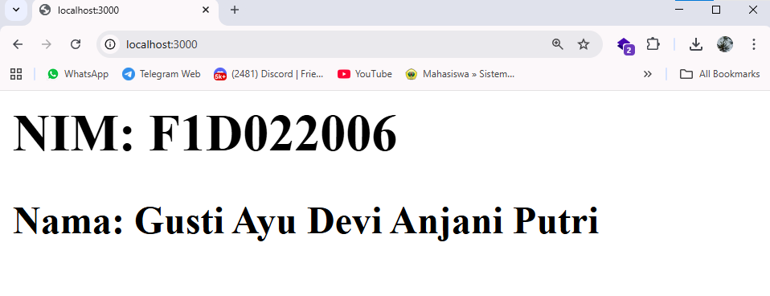
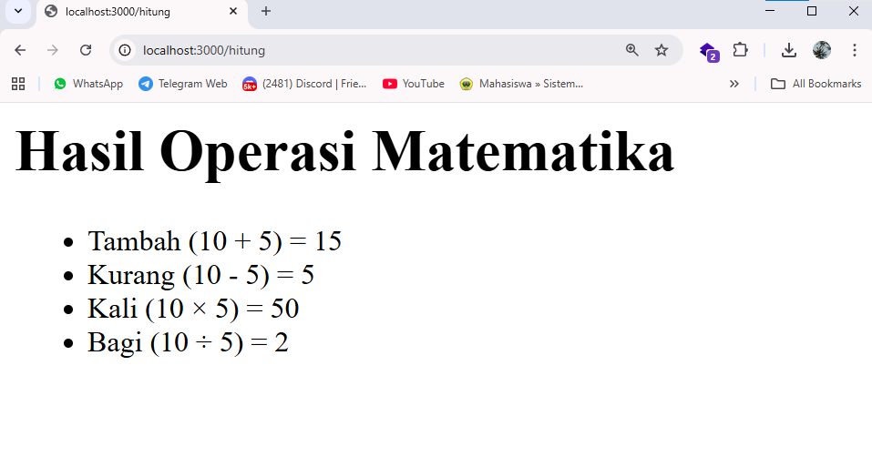
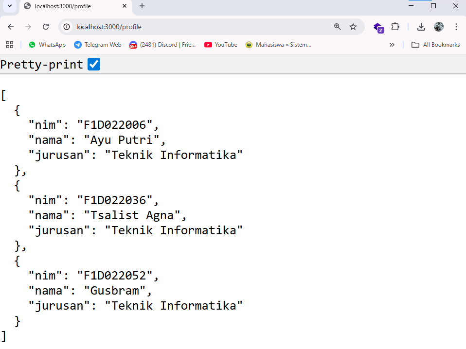
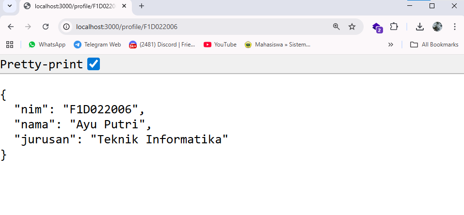

# Assignment: Express.js & Modul Node.js

## Identitas

* Nama : Gusti Ayu Devi Anjani Putri
* NIM  : F1D022006

---

## Deskripsi Tugas

Project ini dibuat untuk memenuhi Assignment 3 pada mata kuliah Pemrograman Web, dengan tujuan memahami dasar penggunaan **Express.js** dan **modul lokal Node.js**.

Aplikasi Express.js ini memiliki beberapa route utama, menggunakan modular routing, serta memanfaatkan modul lokal untuk operasi matematika.

---

## Hasil

Berikut adalah hasil pengujian setiap route yang dijalankan pada browser:

### 1. Route `/`

Menampilkan identitas mahasiswa berupa **NIM dan Nama**.



---

### 2. Route `/hitung`

Menampilkan hasil operasi matematika (tambah, kurang, kali, bagi) yang berasal dari modul lokal `math.js`.



---

### 3. Route `/profile`

Menampilkan seluruh data profile mahasiswa dalam bentuk **JSON Array**.



---

### 4. Route `/profile/:nim`

Menampilkan detail profile berdasarkan **NIM**.

Contoh pengujian:

```
/profile/F1D022006
```



---